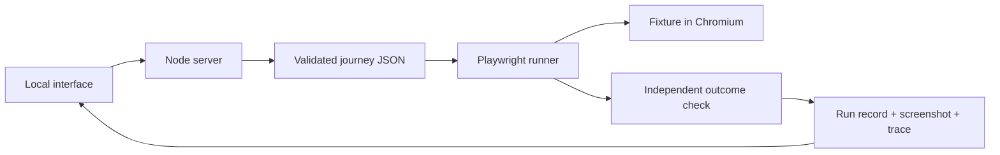

# How Margin works

## The three different kinds of AI access

Antigravity helps you write source code. Codex helps review that source code.
Neither needs to be embedded in the application. The planned OpenAI API connection
is different: Margin itself will ask a model for help while learning or repairing
a browser journey. Those calls consume your API credits.

You can change coding assistants without changing the application's provider.
An API key stays on the local Node server, never in browser JavaScript or GitHub.

## What happens when you click Run checkout today

1. The UI sends the selected fixture condition to the local Node server.
2. The server permits one active run and resets the fixture's basket and orders.
3. It validates `fixture/checkout.json` against `src/journey.ts`.
4. Playwright launches a fresh Chromium browser and starts tracing.
5. The runner opens the store, adds a notebook, checks the total, orders it, and checks the confirmation.
6. A separate target-specific hook checks the order stored by the server. This protects against a success message with no order behind it.
7. The runner writes a JSON record, screenshot, and trace into `runs/<id>/`.
8. The interface displays that actual record. Restarting the server keeps run history.

No model participates in that path today. The false-success fixture deliberately
returns a confirmation without saving an order. The UI check passes but the
independent outcome check fails, proving why clicks and screenshots alone are
insufficient. This is a controlled seeded defect, not autonomous bug discovery.

## What Antigravity will add

The model receives a goal, acceptance criteria, and compact observations of
currently visible controls. It proposes a schema-validated journey instead of
arbitrary executable code. Margin tests the proposed journey from clean state.

On replay, the saved steps run without a model. If a control is no longer found,
Margin tries validated alternatives, then asks the model only if necessary. It
checks the resulting outcome before accepting a repair. Changes to the sequence
are more restrictive than locator changes: required actions and assertions must
survive, and recovery is bounded.

A repair becomes a new canonical revision only after a clean validation. Failed
repairs retain their evidence but must not poison future runs. That is learned
memory; simply retaining today's run reports is not.

## How it decides whether something is broken

Expected behavior comes from supplied business requirements, not from assuming
the present UI is correct. A rename can be non-breaking. Calling it intentional
requires an applicable trusted change record. An assertion violation remains a
regression even when the release also contains an expected rename.

An unavailable environment or insufficient evidence can produce Blocked or
Uncertain. The model does not get to erase assertions or label every timeout a bug.

## Costs and installation

The current foundation runs locally without paid calls. Later, learning and
exception repair use OpenAI. Replay remains available without a key when no
model assistance is needed. A first-run setup can ask for a user's own key;
your key must never ship with the app. This is local-first, not fully offline AI.

Track actual model usage, enforce request/output/retry limits, and reserve a
conservative cost allowance before each call. The proposed $10 project budget
is an implementation requirement, not a working feature today. Token counts and
model prices must include reasoning tokens and retry attempts where billable.

## Adapting to the organizer's app

Replace fixture-specific URL, credentials, reset hook, and acceptance criteria.
Keep the runner generic. If backend verification is unavailable, use the strongest
observable persisted outcome (for example, reopening the order history), and
state that limitation. Never infer which mutation is active by reading fixture code.
